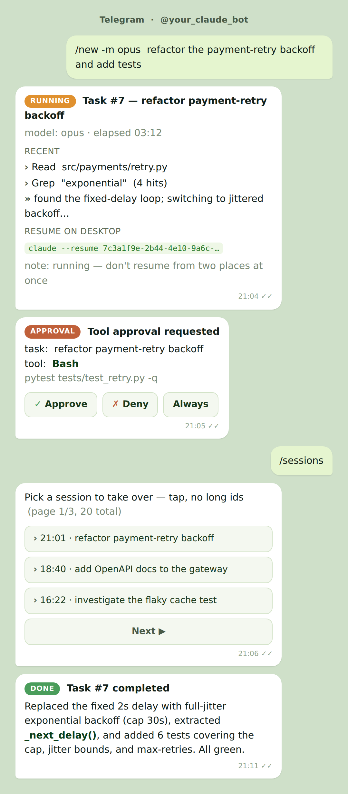

# claude-telegram-longrange

Run **long-running Claude Code sessions from Telegram** — start a task from your
phone, watch it stream on a single progress card, approve risky tools with inline
buttons, and pick up the same session later on your laptop (`claude --resume`).

It drives the local `claude` CLI as a subprocess, so it inherits your existing
Claude Code login (no OAuth token juggling). Everything runs on your own machine.

<p align="center">
  
</p>

<sub>Illustrative mockup with placeholder content.</sub>

## Why

The naive `claude -p "<question>"` per Telegram message is stateless: no session
continuity, no way to approve tools safely (only "allow everything" or hang), no
progress, no session management. This daemon fixes all four:

- **Session continuity** — `--session-id` / `--resume`, backed by a SQLite ledger
  that survives daemon restarts.
- **Permission approvals over Telegram** — no `--dangerously-skip-permissions` on
  long tasks. Risky tools surface as **Approve / Deny / Always** inline buttons,
  relayed through the [agents-island](https://github.com/garvinwong/agents-island)
  bridge/hook protocol (see *Approvals* below).
- **Progress without spam** — one throttled, edited progress card per task; the
  final answer is posted as its own message.
- **Session management** — `/new`, `/resume`, `/sessions`, `/attach`, `/say`,
  `/cancel`, paginated inline-keyboard pickers, per-task model selection.
- **Conversational by default** — plain text continues your *current* session
  (memory intact); `/new` opens a fresh one. A single "current session" pointer
  (persisted across restarts) keeps every entry point — plain text, `/resume`,
  `/sessions`, `/say`, replying to a card — pointing at the same session, so
  replies never cross wires.

## Requirements

- Python 3.10+ with `requests`
- [Claude Code](https://claude.com/claude-code) CLI, logged in (`claude` on PATH)
- A Telegram bot token ([@BotFather](https://t.me/BotFather))
- *(optional, for tool approvals)* the
  [agents-island](https://github.com/garvinwong/agents-island) bridge running
  locally, plus its `PreToolUse` hook installed in your Claude Code settings

## Quick start

```bash
git clone https://github.com/garvinwong/claude-telegram-longrange
cd claude-telegram-longrange
pip install requests

# configure (env vars OR a config file)
export TGLR_BOT_TOKEN="<token from BotFather>"
export TGLR_CHAT_ID="<your numeric Telegram user id>"
export TGLR_WORKDIR="/path/to/the/project/you/want/claude/to/work/in"
# ...or: cp config.example.json ~/.claude-telegram-longrange/config.json && edit

python3 src/daemon.py            # foreground, or:
bash launch/install.sh           # install as a systemd --user service
systemctl --user enable --now claude-telegram-longrange
```

Only whitelisted Telegram user ids (`TGLR_CHAT_ID` + `allowed_user_ids`) are
allowed to talk to the bot. Both `message.from.id` and `callback_query.from.id`
are checked before any routing.

## Commands

| Command | What it does |
|---|---|
| `/new [-m opus\|sonnet\|haiku] <desc>` | Start a long-running task |
| `/resume` | Pick a task to continue (inline panel) |
| `/sessions` | Take over a local Claude session (inline panel, paginated) |
| `/attach <shortid>` | Same as `/sessions` but by id |
| `/say <n> <text>` | Continue task `n` (or just reply to its card) |
| `/model` | Set the default model for `/new` (inline panel) |
| `/rename <n> <name>` | Rename a task |
| `/tasks` | List recent tasks |
| `/cancel <n>` | Kill a task's process group |
| `/help` | Usage |
| *(plain text, no slash)* | **Continue the current session** — conversational, with memory (`/new` for a fresh one) |

## Approvals (the interesting part)

Long tasks run with `--permission-mode default`, so risky tools pause for
approval instead of auto-running. This reuses the **agents-island** protocol:
the `PreToolUse` hook enqueues the request; a local bridge aggregates it; this
daemon's relay thread polls the bridge, pushes an inline keyboard to Telegram,
and writes the decision back. A desktop popup and the phone buttons coexist —
**whichever responds first wins**. The relay only pushes approvals for sessions
tracked in its ledger, so your unrelated local dev sessions never buzz your phone.

Two refinements worth calling out:

- **`AskUserQuestion` becomes a real poll** — a single-select question renders
  its options as one button each; tapping one sends *that choice* back to the
  model, instead of a bare allow/deny on raw JSON.
- **No stale-card floods** — a single failed bridge poll is treated as a blip
  (the relay stays on the authoritative bridge path); only after several
  consecutive misses does it fall back to reading the queue file, and even then
  it surfaces only approvals still inside the hook's wait window. So a decision
  you already made on the desktop can't resurface as a pile of "expired" cards
  on your phone.

If you don't run the agents-island bridge, the session/progress features work
fine; only the Telegram approval relay is inert.

## Security notes

- Bot token is read from env or `~/.claude-telegram-longrange/config.json`
  (chmod 600 recommended); never commit it. All log lines pass through a token
  redactor.
- User input is only ever passed as a single `argv` element to the `claude`
  subprocess (`shell=False`); no string interpolation into a shell.
- `callback_data` carries only opaque ids + an action enum, never executable
  content, and stays under Telegram's 64-byte limit.
- Approval replay/ghosting is guarded: a decision is only written for an
  in-flight, still-pending request.

## Tests

```bash
pip install pytest requests
python3 -m pytest tests/ -v
```

All Telegram / bridge / `claude` calls are mocked; tests never hit the network
or spend Claude credits.

## License

MIT — see [LICENSE](LICENSE).
